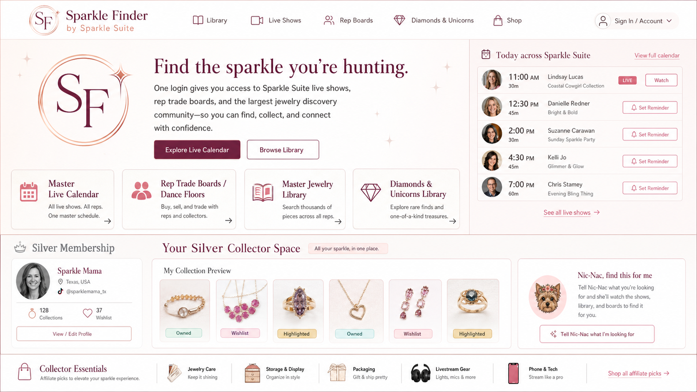

# Locked Homepage And UI Direction

Decision date: 2026-05-29
Lock status: Approved by Louis as the expected final-product look

## Locked Direction

Use the updated Concept 2 image mockup as the locked Sparkle Finder homepage/UI direction.

Louis approved the logo, design, layout, and overall look and expects the final product to follow this direction closely. This should become the base visual target for the first homepage and authenticated hub shell.

Reference image:

## Core Layout Idea

- editorial directory/discovery layout
- `Today across Sparkle Suite` agenda panel
- strong first-viewport signal for `Sparkle Finder by Sparkle Suite`
- main Sparkle Suite brand system
- `SF` circular seal inspired by the Sparkle Suite `S` seal
- clear paths into live shows, rep boards/dance floors, jewelry library, and Diamonds & Unicorns
- restrained Silver Membership strip that frames Nic-Nac as convenience, not required access
- Silver Collector Space integrated into the homepage rather than treated as a separate advertisement
- customer profile preview with display name, state, TikTok handle, collection count, and wishlist/watchlist count
- compact personal collection preview with owned, wishlist, and highlighted states
- Nic-Nac `find this for me` module next to the collector/library experience

## Free Experience On This Screen

Free logged-in customers should see the hub as a browsing and discovery surface:

- master live calendar
- Sparkle Suite rep directory
- aggregated rep trade boards/dance floors
- master jewelry library
- Diamonds & Unicorns Library
- manual search and filters
- affiliate/shop links for collector and live-streaming gear

## Silver Additions Missing From The Mockup

Add customer profile and collection as Silver Membership features.

Silver should include:

- customer profile
- optional profile photo
- optional TikTok handle/link
- state-level location
- customer collection built from existing master jewelry library records
- collection showcase/highlight areas
- saved collection items and collector notes
- `Nic-Nac, find this for me` from jewelry/library contexts
- saved searches/watchlist and alerts if included

## Brand Notes

- Use the main Sparkle Suite brand.
- Do not use the Amethyst skin/template at this time.
- Do not imply official Bomb Party partnership.
- Do not make customer-to-customer trading part of the homepage promise.
- Preserve the locked visual direction while correcting any generated mockup copy that conflicts with product guardrails. In particular, final production copy must avoid buy/sell language in v1.
