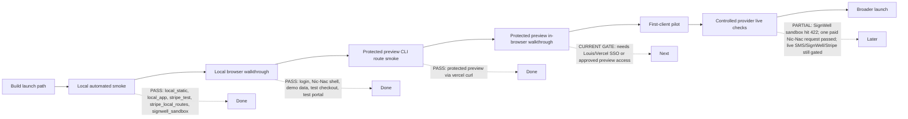

# Sparkle Suite Launch Readiness - 2026-05-18

## Ready for demo

- Operator runbook: `docs/sparkle-suite/demo-launch-runbook-2026-05-18.md`.
- Browser smoke walkthrough: `docs/sparkle-suite/browser-smoke-walkthrough-2026-05-18.md`.
- Stripe subscription checkout and billing portal routes now return actionable configuration errors and use the authenticated rep identity for checkout metadata.
- Stripe webhook handling has focused coverage for signature-gated subscription updates.
- `npm run smoke:stripe:webhook-test-config` now checks Stripe test-mode webhook endpoint configuration with a read-only provider call.
- `npm run smoke:stripe:webhook-local-signature` now proves the running local app accepts a correctly signed Stripe webhook payload without contacting Stripe or changing subscription state.
- `npm run stripe:live-prices -- --env-file <ignored-production-env> --json` is available for finding approved live build-fee, founder monthly, and standard monthly prices once a live Stripe key is installed; creating missing live prices requires `--apply` plus an approval timestamp.
- SignWell agreement onboarding can build a sandbox payload and blocks live sends unless `SIGNWELL_ALLOW_LIVE_SEND=true`.
- SignWell sandbox provider smoke is implemented as `npm run smoke:signwell:sandbox-provider`; it requires `SIGNWELL_SANDBOX_PROVIDER_CALL=true`, `test_mode=true`, and `send_email=false`.
- Demo account seed planning is repeatable by `DEMO_REP_EMAIL`, includes 2 upcoming shows, 10 listings, 5 audience members, and no live-provider actions.
- `npm run smoke:demo -- --category local_static` now executes a provider-free static smoke check against the demo seed shape.
- `npm run smoke:demo -- --category local_static --json` emits a machine-readable report without env secrets or dotenv noise.
- `npm run smoke:demo -- --category supabase_demo --json` has been run for `louis+sparkle-demo@neonrabbit.net`; it seeded the account and verified demo login/read access.
- `npm run smoke:demo -- --category local_app --json` has been run against `http://localhost:3000`; it verified `/api/nic-nac/me` and the `/nic-nac` shell for the demo rep.
- `npm run stripe:demo-price -- --json` now prepares three Stripe test prices without checkout or charge: `STRIPE_PRICE_BUILD_FEE`, `STRIPE_PRICE_FOUNDER_MONTHLY`, and `STRIPE_PRICE_STANDARD_MONTHLY`.
- `npm run smoke:demo -- --category stripe_test --json` now requires all three itemized Stripe price ids so checkout can show the `Sparkle Suite build fee` separately from the monthly subscription.
- Founder checkout webhook handling now creates a Stripe subscription schedule so the first 20 reps receive 12 paid months at the founder monthly price and then step up to the standard monthly price.
- `npm run smoke:launch -- --categories local_static,stripe_test --json --write-report` is available for a repeatable safe aggregate smoke report.
- `npm run smoke:demo -- --category stripe_local_routes --json` passed against `http://localhost:3000`, creating Stripe test-mode checkout and portal sessions only.
- Vercel Development, Preview, and Production now have `STRIPE_PRICE_BUILD_FEE`, `STRIPE_PRICE_FOUNDER_MONTHLY`, and `STRIPE_PRICE_STANDARD_MONTHLY` configured for test-mode itemized checkout.
- Protected Vercel Preview `https://sparkle-suite-2chlrqw8y-louis-2849s-projects.vercel.app` passed demo auth, Nic-Nac shell, Stripe test checkout session, and Stripe test portal session smoke through authenticated `vercel curl`.
- Most recently smoke-tested protected Vercel Preview `https://sparkle-suite-lxmbprga8-louis-2849s-projects.vercel.app` passed with a temporary rotated demo password, verifying demo auth, Nic-Nac shell, Stripe test checkout session, and Stripe test portal session through authenticated `vercel curl`.
- `npm run smoke:launch:preview-temp-demo -- --target https://sparkle-suite-lxmbprga8-louis-2849s-projects.vercel.app` passed on 2026-05-19 for the most recently smoke-tested protected preview; report: `.local/launch-smoke-results/launch-preview-2026-05-19T18-26-00-116Z.json`.
- Production deploy `https://sparkle-suite-nomj5q272-louis-2849s-projects.vercel.app` is aliased to `https://www.yoursparklesuite.com` and passed public-domain route smoke for demo auth, Nic-Nac shell, Stripe test checkout session, and Stripe test portal session; report: `.local/launch-smoke-results/launch-preview-2026-05-19T20-21-18-744Z.json`.
- Vercel env now has `SIGNWELL_API_KEY`, `SIGNWELL_API_BASE_URL`, and `SIGNWELL_TEMPLATE_ID` in Development and Preview for `codex/sparkle-cross-phase-hardening`.
- `npm run smoke:demo -- --category signwell_sandbox --json` passed for `louis+sparkle-demo@neonrabbit.net`, building a non-sending payload with `send_email=false`.
- `npm run smoke:signwell:live-preflight` passed on 2026-05-18 for `louis+sparkle-demo@neonrabbit.net`, building a live-like non-sending payload with `send_email=false`, `test_mode=false`, production SignWell base URL mode, and `SIGNWELL_ALLOW_LIVE_SEND` unset.
- `npm run smoke:stripe:live-preflight` is available and was attempted on 2026-05-18 without creating checkout or charge traffic; it is blocked because Production currently has Stripe key mode `test` and is missing the three approved live price ids for build fee, founder monthly, and standard monthly checkout.
- `npm run smoke:nic-nac:paid-preflight` passed on 2026-05-18 with approved requests capped at 1, `NIC_NAC_ALLOW_PAID_SMOKE` unset, and `paid_calls_executed=false`.
- `npm run smoke:demo -- --category stripe_test --json` validates test-mode Stripe config without creating a checkout session.
- `npm run smoke:launch:restored` passed on 2026-05-18 for `local_static`, `local_app`, `stripe_test`, `stripe_local_routes`, and `signwell_sandbox`; report: `.local/launch-smoke-results/launch-local-2026-05-18T21-54-56-095Z.json`. The restored batch now also includes `stripe_webhook_local_signature` for future runs.
- Local browser walkthrough passed on 2026-05-18 for demo login, `/nic-nac` shell, Trade Board demo data, Calendar demo shows, customer roster, Account Billing, Stripe test checkout cancel/return, and Stripe test billing portal reachability/return by browser back.
- Account Billing now exposes Stripe portal access when a Stripe test customer exists before subscription activation, so the local browser smoke can verify the portal without completing a checkout charge.

## Launch path map

## P0 launch blockers

- Telnyx 10DLC approval is still pending. Do not attach `+19044383050` or send live SMS until campaign approval and number attachment are confirmed.
- Live Stripe readiness is not claimed. Production currently has Stripe key mode `test`; live price creation is blocked until Louis installs or provides the live Stripe secret/publishable keys. The approved live price helper is ready for the $49.99 build fee, $49.99 founder monthly, and $74.99 standard monthly prices.
- Stripe test webhook endpoint configuration now exists for `https://www.yoursparklesuite.com/api/stripe/webhook`. Louis approved installing the generated secret into Vercel Production on 2026-05-19, Production was redeployed from clean commit `5606fb0`, and public-domain route smoke passed afterward.
- Live SignWell sends are not approved. Sandbox/dry-run payloads and live preflight are ready, but real agreements require explicit Louis approval.
- One paid Nic-Nac public-domain smoke request has run under Louis's $5 stop cap and passed. Any additional paid Nic-Nac requests still need an explicit scope/request-count approval.

## P1 onboarding blockers

- Demo login smoke no longer requires Louis to know or type the demo password when using `npm run smoke:launch:preview-temp-demo -- --target <preview-url>`; that helper rotates a temporary password for the run and does not print it. Set a stable customer-facing password only when the demo account is ready to share outside internal testing.
- Production Vercel itemized Stripe prices are set for test-mode checkout, and live preflight still sees Production Stripe key mode `test`; install live Stripe production keys before any live checkout smoke.
- Protected preview browser checkout walkthrough is documented but still needs a final in-browser pass with Louis/Vercel SSO and test-mode Stripe only.
- Vercel Deployment Protection remains enabled for browser access; authenticated `vercel curl` smoke passes on the latest preview, while browser walkthrough still needs Louis/Vercel SSO or an approved private bypass path.
- SignWell live preflight has passed. Keep `SIGNWELL_ALLOW_LIVE_SEND` unset unless Louis explicitly approves recipient, template, and timing for a real send.

## P2 post-launch polish

- Protected preview in-browser walkthrough remains before first-client pilot.
- Add a compact admin view link list for the demo rep once Louis chooses the first-user launch scope.

## Provider status

- Stripe: itemized test-mode route readiness is implemented in code; founder subscriptions now schedule the month-13 step-up to standard monthly pricing. Live preflight exists and is currently blocked by production key mode `test` plus missing production build-fee, founder monthly, and standard monthly price approvals.
- Stripe test prices created on 2026-05-19 without checkout or charge:
  - `STRIPE_PRICE_BUILD_FEE=price_1TYqHyHRBK3pZpO26Zaoo3Yp`
  - `STRIPE_PRICE_FOUNDER_MONTHLY=price_1TYqHyHRBK3pZpO2ARvGqX7b`
  - `STRIPE_PRICE_STANDARD_MONTHLY=price_1TYqHzHRBK3pZpO2wZPbJ1QH`
- Vercel Development, branch Preview for `codex/sparkle-cross-phase-hardening`, and Production now have those three Stripe test price env vars for test-mode checkout.
- `npm run smoke:launch -- --categories local_static,stripe_test --json --write-report` passed on 2026-05-19 with the itemized Stripe test prices; report: `.local/launch-smoke-results/launch-local-2026-05-19T16-20-01-436Z.json`.
- `npm run stripe:ensure-test-webhook -- --target https://www.yoursparklesuite.com --apply --write-secret-file .local\stripe-test-webhook-www.secret --json` created the Stripe test-mode endpoint for `https://www.yoursparklesuite.com/api/stripe/webhook` on 2026-05-19 with the required subscription events. The generated secret is stored only in ignored local storage.
- `npm run smoke:stripe:webhook-test-config` passed on 2026-05-19 for `https://www.yoursparklesuite.com`, reporting `endpoint matched=true`, `endpoint_status=enabled`, and `missing_events=none`.
- Louis approved replacing Vercel Production `STRIPE_WEBHOOK_SECRET` on 2026-05-19. Production was redeployed from clean commit `5606fb0` after the env change; public-domain route smoke passed against `https://www.yoursparklesuite.com`.
- `npm run stripe:live-prices -- --env-file .local\vercel-production.env --json` stopped safely because Production `STRIPE_SECRET_KEY` is still test mode. No live Stripe prices were created.
- `npm run smoke:stripe:webhook-local-signature` passed on 2026-05-19 against `http://localhost:3000`, using a synthetic signed Stripe event with `provider_call=none` and `subscription_state_changed=false`.
- `tests/stripe-webhook-route.test.ts` now verifies founder checkout creates a Stripe subscription schedule with 12 founder monthly iterations followed by the standard monthly price, and stores the schedule id on the subscription row.
- Supabase schema application completed on 2026-05-19. Local remote-history placeholder migrations were added for previously remote-only versions (`021`, `023`, `025`, `030`, `034`, `035`, `036`, `037`) so `supabase db push` could safely apply `20260513172454_ss_prelaunch_payment_gates.sql` and `20260519154500_ss_pricing_referrals.sql`. Verification passed for `reps.referral_code`, subscription pricing metadata columns, `sparkle_suite_intake_submissions.referral_code`, and `rep_referrals`.
- Fresh Vercel Preview deployed on 2026-05-19: `https://sparkle-suite-lxmbprga8-louis-2849s-projects.vercel.app`. Build passed. Protected preview route smoke passed after rotating a temporary demo password in-memory; do not put demo passwords in docs, commits, screenshots, or chat.
- SignWell: sandbox/dry-run payload and live preflight readiness implemented and passed with `send_email=false`; live send remains parked behind `SIGNWELL_ALLOW_LIVE_SEND=true` and explicit approval.
- SignWell sandbox provider contact was attempted with Development env on 2026-05-19 after Louis approval. Two test-mode, non-email provider attempts returned HTTP 422, including one retry with `SIGNWELL_TEMPLATE_RECIPIENT_PLACEHOLDER=Customer`; no live agreement email was sent.
- Telnyx: live SMS parked until 10DLC approval and number attachment.
- Nic-Nac: one approved paid public-domain smoke request ran on 2026-05-19 against `https://www.yoursparklesuite.com/api/nic-nac` with a $5 stop cap; it returned HTTP 200, produced a stream, and stopped after exactly one request.
- Supabase: demo seed and login/read smoke passed for `louis+sparkle-demo@neonrabbit.net`; visible counts were reps=1, listings=10, shows=2, audience=5.

## Recommended first-user launch scope

- Launch with one seeded demo rep first.
- Local restored smoke, local browser walkthrough, protected preview CLI route smoke, and public production-domain route smoke have passed; next first-client readiness gate is protected preview or production in-browser verification.
- Keep SMS live sends, live SignWell sends, live Stripe charges, and paid Nic-Nac smoke out of the first pass unless Louis approves each provider scope separately.
