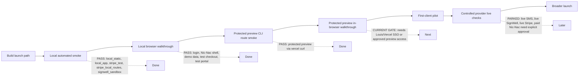

# Sparkle Suite Launch Readiness - 2026-05-18

## Ready for demo

- Operator runbook: `docs/sparkle-suite/demo-launch-runbook-2026-05-18.md`.
- Browser smoke walkthrough: `docs/sparkle-suite/browser-smoke-walkthrough-2026-05-18.md`.
- Stripe subscription checkout and billing portal routes now return actionable configuration errors and use the authenticated rep identity for checkout metadata.
- Stripe webhook handling has focused coverage for signature-gated subscription updates.
- SignWell agreement onboarding can build a sandbox payload and blocks live sends unless `SIGNWELL_ALLOW_LIVE_SEND=true`.
- Demo account seed planning is repeatable by `DEMO_REP_EMAIL`, includes 2 upcoming shows, 10 listings, 5 audience members, and no live-provider actions.
- `npm run smoke:demo -- --category local_static` now executes a provider-free static smoke check against the demo seed shape.
- `npm run smoke:demo -- --category local_static --json` emits a machine-readable report without env secrets or dotenv noise.
- `npm run smoke:demo -- --category supabase_demo --json` has been run for `louis+sparkle-demo@neonrabbit.net`; it seeded the account and verified demo login/read access.
- `npm run smoke:demo -- --category local_app --json` has been run against `http://localhost:3000`; it verified `/api/nic-nac/me` and the `/nic-nac` shell for the demo rep.
- `npm run stripe:demo-price -- --json` now prepares three Stripe test prices without checkout or charge: `STRIPE_PRICE_BUILD_FEE`, `STRIPE_PRICE_FOUNDER_MONTHLY`, and `STRIPE_PRICE_STANDARD_MONTHLY`.
- `npm run smoke:demo -- --category stripe_test --json` now requires all three itemized Stripe price ids so checkout can show the `Sparkle Suite build fee` separately from the monthly subscription.
- `npm run smoke:launch -- --categories local_static,stripe_test --json --write-report` is available for a repeatable safe aggregate smoke report.
- `npm run smoke:demo -- --category stripe_local_routes --json` passed against `http://localhost:3000`, creating Stripe test-mode checkout and portal sessions only.
- Vercel Development and Preview previously had only `STRIPE_PRICE_MONTHLY=price_1TYTAZHRBK3pZpO2b6WQ8kUl`; this is no longer sufficient for itemized paid launch checkout. Install `STRIPE_PRICE_BUILD_FEE`, `STRIPE_PRICE_FOUNDER_MONTHLY`, and `STRIPE_PRICE_STANDARD_MONTHLY` before the next Stripe route smoke.
- Protected Vercel Preview `https://sparkle-suite-2chlrqw8y-louis-2849s-projects.vercel.app` passed demo auth, Nic-Nac shell, Stripe test checkout session, and Stripe test portal session smoke through authenticated `vercel curl`.
- Most recently smoke-tested protected Vercel Preview `https://sparkle-suite-47lykmafd-louis-2849s-projects.vercel.app` passed `npm run smoke:launch:preview-protected`, verifying demo auth, Nic-Nac shell, Stripe test checkout session, and Stripe test portal session through authenticated `vercel curl`.
- `npm run smoke:launch:preview-protected` passed on 2026-05-18 for the most recently smoke-tested protected preview; report: `.local/launch-smoke-results/launch-preview-2026-05-18T22-46-13-690Z.json`.
- Vercel env now has `SIGNWELL_API_KEY`, `SIGNWELL_API_BASE_URL`, and `SIGNWELL_TEMPLATE_ID` in Development and Preview for `codex/sparkle-cross-phase-hardening`.
- `npm run smoke:demo -- --category signwell_sandbox --json` passed for `louis+sparkle-demo@neonrabbit.net`, building a non-sending payload with `send_email=false`.
- `npm run smoke:signwell:live-preflight` passed on 2026-05-18 for `louis+sparkle-demo@neonrabbit.net`, building a live-like non-sending payload with `send_email=false`, `test_mode=false`, production SignWell base URL mode, and `SIGNWELL_ALLOW_LIVE_SEND` unset.
- `npm run smoke:stripe:live-preflight` is available and was attempted on 2026-05-18 without creating checkout or charge traffic; it is blocked because Production currently has Stripe key mode `test` and is missing the three approved live price ids for build fee, founder monthly, and standard monthly checkout.
- `npm run smoke:nic-nac:paid-preflight` passed on 2026-05-18 with approved requests capped at 1, `NIC_NAC_ALLOW_PAID_SMOKE` unset, and `paid_calls_executed=false`.
- `npm run smoke:demo -- --category stripe_test --json` validates test-mode Stripe config without creating a checkout session.
- `npm run smoke:launch:restored` passed on 2026-05-18 for `local_static`, `local_app`, `stripe_test`, `stripe_local_routes`, and `signwell_sandbox`; report: `.local/launch-smoke-results/launch-local-2026-05-18T21-54-56-095Z.json`.
- Local browser walkthrough passed on 2026-05-18 for demo login, `/nic-nac` shell, Trade Board demo data, Calendar demo shows, customer roster, Account Billing, Stripe test checkout cancel/return, and Stripe test billing portal reachability/return by browser back.
- Account Billing now exposes Stripe portal access when a Stripe test customer exists before subscription activation, so the local browser smoke can verify the portal without completing a checkout charge.

## Launch path map

## P0 launch blockers

- Telnyx 10DLC approval is still pending. Do not attach `+19044383050` or send live SMS until campaign approval and number attachment are confirmed.
- Live Stripe readiness is not claimed. Production currently has Stripe key mode `test` and no production itemized price set; a real live checkout smoke still needs explicit Louis approval for key mode, build-fee price, founder monthly price, standard monthly price, path, and amount.
- Live SignWell sends are not approved. Sandbox/dry-run payloads and live preflight are ready, but real agreements require explicit Louis approval.
- Paid Nic-Nac provider smoke preflight passed with a 1-request cap, but actual paid calls remain blocked until `NIC_NAC_ALLOW_PAID_SMOKE=true` is set for a separately approved run.

## P1 onboarding blockers

- First demo login smoke uses the built-in demo password unless `DEMO_REP_PASSWORD` is set. Rotate or set a custom demo password before sharing the account outside Louis.
- Production Vercel itemized Stripe prices are intentionally not set yet, and live preflight saw production Stripe key mode `test`; verify or install live Stripe production config before any live checkout smoke.
- Protected preview browser checkout walkthrough is documented but still needs a final in-browser pass with Louis/Vercel SSO and test-mode Stripe only.
- Vercel Deployment Protection remains enabled for browser access; authenticated `vercel curl` smoke passes on the latest preview, while browser walkthrough still needs Louis/Vercel SSO or an approved private bypass path.
- SignWell live preflight has passed. Keep `SIGNWELL_ALLOW_LIVE_SEND` unset unless Louis explicitly approves recipient, template, and timing for a real send.

## P2 post-launch polish

- Protected preview in-browser walkthrough remains before first-client pilot.
- Add a compact admin view link list for the demo rep once Louis chooses the first-user launch scope.

## Provider status

- Stripe: itemized test-mode route readiness is implemented in code; live preflight exists and is currently blocked by production key mode `test` plus missing production build-fee, founder monthly, and standard monthly price approvals.
- Stripe test prices created on 2026-05-19 without checkout or charge:
  - `STRIPE_PRICE_BUILD_FEE=price_1TYqHyHRBK3pZpO26Zaoo3Yp`
  - `STRIPE_PRICE_FOUNDER_MONTHLY=price_1TYqHyHRBK3pZpO2ARvGqX7b`
  - `STRIPE_PRICE_STANDARD_MONTHLY=price_1TYqHzHRBK3pZpO2wZPbJ1QH`
- Vercel Development and branch Preview for `codex/sparkle-cross-phase-hardening` now have those three Stripe test price env vars. Production was not changed.
- `npm run smoke:launch -- --categories local_static,stripe_test --json --write-report` passed on 2026-05-19 with the itemized Stripe test prices; report: `.local/launch-smoke-results/launch-local-2026-05-19T16-20-01-436Z.json`.
- Supabase schema application completed on 2026-05-19. Local remote-history placeholder migrations were added for previously remote-only versions (`021`, `023`, `025`, `030`, `034`, `035`, `036`, `037`) so `supabase db push` could safely apply `20260513172454_ss_prelaunch_payment_gates.sql` and `20260519154500_ss_pricing_referrals.sql`. Verification passed for `reps.referral_code`, subscription pricing metadata columns, `sparkle_suite_intake_submissions.referral_code`, and `rep_referrals`.
- Fresh Vercel Preview deployed on 2026-05-19: `https://sparkle-suite-lxmbprga8-louis-2849s-projects.vercel.app`. Build passed. Protected preview route smoke is ready but blocked locally until `DEMO_REP_PASSWORD` is set in the shell or `.env.local`; do not put the password in docs, commits, screenshots, or chat.
- SignWell: sandbox/dry-run payload and live preflight readiness implemented and passed with `send_email=false`; live send remains parked behind `SIGNWELL_ALLOW_LIVE_SEND=true` and explicit approval.
- Telnyx: live SMS parked until 10DLC approval and number attachment.
- Nic-Nac: paid smoke preflight passed with a 1-request cap and no provider calls; actual paid smoke remains parked behind explicit paid-smoke env gates and final approval.
- Supabase: demo seed and login/read smoke passed for `louis+sparkle-demo@neonrabbit.net`; visible counts were reps=1, listings=10, shows=2, audience=5.

## Recommended first-user launch scope

- Launch with one seeded demo rep first.
- Local restored smoke, local browser walkthrough, and protected preview CLI route smoke have passed; next first-client readiness gate is protected preview in-browser verification.
- Keep SMS live sends, live SignWell sends, live Stripe charges, and paid Nic-Nac smoke out of the first pass unless Louis approves each provider scope separately.
