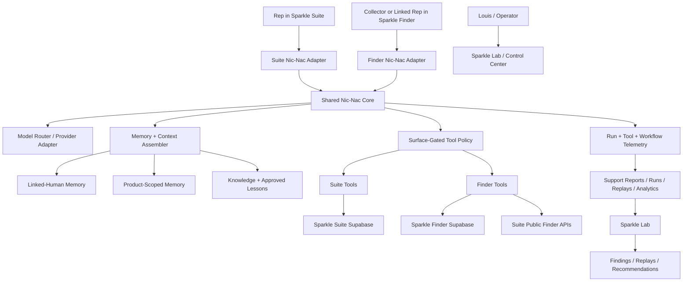

# Nic-Nac Cross-Ecosystem Rebuild Implementation Plan

> **For agentic workers:** REQUIRED SUB-SKILL: Use superpowers:subagent-driven-development (recommended) or superpowers:executing-plans to implement this plan task-by-task. Steps use checkbox (`- [ ]`) syntax for tracking.

**Goal:** Rebuild Nic-Nac into one shared Sparkle ecosystem assistant across Sparkle Suite and Sparkle Finder, with linked-human memory, surface-gated tools, OpenAI-first model routing, Secret Rep ID linking, and a bounded Sparkle Lab improvement loop.

**Architecture:** Build a provider-neutral Nic-Nac core that receives product context, identity context, memory context, surface policy, and allowed tools from product adapters. Sparkle Suite and Sparkle Finder keep separate auth boundaries and product-owned mutations, but call the same core contract so Nic-Nac feels like one assistant rather than copied chatbots. Sparkle Lab is a separate internal researcher/recommender that consumes telemetry, support reports, replay cases, and analytics without mutating production.

**Tech Stack:** Next.js 16 App Router, React 19, TypeScript, Vercel AI SDK, OpenAI model provider adapter, Supabase Postgres/RLS, Sparkle Suite public Finder APIs, Sparkle Finder Supabase project, Playwright/Chrome reviewer-smoke, Vitest, Vercel stable demo alias.

---

## Non-Negotiable Product Decisions

- There is one production Nic-Nac across Sparkle Suite and Sparkle Finder.
- Sparkle Finder must not get a copied prompt/tool fork. Finder calls the shared core with Finder context.
- Production Nic-Nac cannot self-mutate production prompts, tools, permissions, product behavior, pricing, code, or global lessons.
- Lab Nic-Nac/Sparkle Lab can study, replay, draft, and recommend. It cannot deploy or promote changes.
- The private Live Queue code is now the **Secret Rep ID Number** in user-facing copy. It keeps Live Queue sync use and becomes the Finder rep-claim code.
- Finder rep claiming links a Finder user to durable Sparkle Suite `rep_id`, grants Silver, and adds a BP Rep / verified rep badge only.
- Linked reps share Nic-Nac memory across Suite and Finder, but Suite mutations must happen from Suite and Finder mutations from Finder.
- Nic-Nac personality foundation is September Virgo: organized, detail-minded, service-oriented, practical, warm, sweet, professional, lightly funny. Mention `Virgo` only if asked or in light/playful conversation.
- Nic-Nac stays mission-focused: Sparkle Suite, Sparkle Finder, Bomb Party, live shows, social selling, rep business goals, collectors, jewelry, streaming/hardware guidance, and system help.
- Nic-Nac politely redirects unrelated general chatbot, therapy, grocery-list, or broad personal-assistant use.
- Memory is a marketed product feature. No broad customer-facing memory tuning panel for beta, but internal/legal correction and deletion paths remain required.
- Sparkle Lab runs on bounded schedule or explicit trigger only. Initial weekly cap: `$5/run`, `$20/month`, 20 model calls, max 4 premium/deep calls, 20 minutes, 250 candidate records, 25 deep-analyzed items, 3 headline findings, 2 active priorities.

## Current System Audit Baseline

### Sparkle Suite Repo

Active repo:

`C:\Users\louis\sparkle-suite-repo`

Important existing files:

- `app/api/nic-nac/route.ts` - authenticated rep workspace Nic-Nac route, currently Anthropic Haiku.
- `app/api/public/nic-nac/route.ts` - public/landing Nic-Nac route, currently Anthropic Haiku.
- `lib/nic-nac/prompt-builder.ts` - active Suite prompt builder.
- `lib/nic-nac/system-prompt.ts` - legacy/static prompt content still referenced by tests.
- `lib/nic-nac/tools/index.ts` - Suite tool registry and intent routing.
- `lib/nic-nac/surface-policy.ts` - early surface policy contract; should become central.
- `lib/nic-nac/surfaces.ts` - current surface enum: `public_landing`, `rep_workspace`, `customer_site`, `sparkle_finder`.
- `lib/nic-nac/persistence.ts` - persisted conversations, assistant reservation/checkpoint/complete/abort.
- `lib/nic-nac/run-telemetry.ts` - run telemetry into `nic_nac_runs`.
- `lib/nic-nac/memory.ts` - rep memory type constants.
- `lib/nic-nac/tools/read-recent-rep-notes.ts` - read rep memory.
- `lib/nic-nac/tools/write-rep-note.ts` - write rep memory.
- `lib/nic-nac/show-sessions.ts` - current show memory.
- `lib/nic-nac/workflows/*` - Trade Board intake workflow state/controller/store/eval.
- `lib/sparkle-finder/public-api.ts` - Suite-owned public Finder catalog/availability/live-show API helper.
- `app/api/public/finder/catalog/route.ts` - public catalog list.
- `app/api/public/finder/catalog/[designId]/route.ts` - public catalog detail.
- `app/api/public/finder/catalog/facets/route.ts` - public catalog facets.
- `app/api/public/finder/availability/route.ts` - public availability and lead path.
- `app/api/public/finder/live-shows/route.ts` - public live shows.
- `app/api/internal/finder/jewelry-intake/route.ts` - Finder-to-Suite internal intake bridge.
- `lib/services/live-queue.ts` - private per-rep code storage and Live Queue sync helpers.
- `lib/nic-nac/tools/ensure-live-queue-sync-code.ts` - current code-generation tool.
- `supabase/functions/live-queue-sync/index.ts` - Live Queue sync function using `sync_code`.
- `supabase/migrations/043_ss_structured_rep_memory.sql` - structured rep memory.
- `supabase/migrations/044_ss_nic_nac_show_sessions.sql` - current show memory.
- `supabase/migrations/045_ss_nic_nac_run_telemetry.sql` - Nic-Nac telemetry.
- `supabase/migrations/20260612100000_support_reports.sql` - support reports feedstock for Lab.
- `docs/superpowers/specs/2026-06-21-nic-nac-sparkle-lab-scalable-memory-loop.md` - locked architecture spec.

Current Suite gap summary:

- Uses `@ai-sdk/anthropic` and hardcoded `claude-haiku-4-5-20251001`.
- No OpenAI provider adapter yet.
- `surface-policy.ts` exists but is not the central enforcement layer.
- Secret Rep ID copy/labeling is not implemented; code still says Live Queue sync code.
- Rep memory exists, but not as linked-human cross-product memory.
- Sparkle Lab is planned but not implemented.

### Sparkle Finder Repo

Active repo:

`C:\Users\louis\sparkle-finder-repo`

Important existing files:

- `app/api/finder/nic-nac/route.ts` - Finder Nic-Nac route, currently Anthropic Haiku, thinner than Suite route.
- `lib/sparkle-finder/nic-nac/prompt-builder.ts` - Finder-specific prompt.
- `lib/sparkle-finder/nic-nac/tools.ts` - Finder tool routing/registry, currently sparse.
- `lib/sparkle-finder/nic-nac/curator.ts` - regex-style intent helper.
- `lib/sparkle-finder/customer-memory.ts` - customer memory store and guardrails.
- `lib/sparkle-finder/account-service.ts` - Finder auth/account mapping, `sparkle_suite_rep_id`, `silver_rep_included`.
- `lib/sparkle-finder/rep-entitlements.ts` - currently fixture-backed Suite rep entitlement adapter.
- `lib/sparkle-finder/catalog-service.ts` - calls Suite public Finder APIs.
- `lib/sparkle-finder/favorite-reps-service.ts` - favorite rep cards.
- `lib/sparkle-finder/favorite-reps-state.ts` - favorite rep persistence.
- `lib/sparkle-finder/showcase-*` - Showcase/Silver plumbing.
- `supabase/migrations/20260531223743_sparkle_finder_accounts.sql` - Finder profiles/memberships.
- `supabase/migrations/20260615000100_sparkle_finder_customer_memory.sql` - customer memory table.
- `supabase/migrations/20260617_sparkle_finder_social_favorites.sql` - favorite reps/social tables.
- `docs/decisions/2026-05-31-silver-membership-and-rep-identity.md` - one account per person, `silver_rep_included`.
- `docs/superpowers/plans/2026-06-15-nic-nac-led-collection-ux.md` - Finder Nic-Nac-led UX plan.

Current Finder gap summary:

- Uses `@ai-sdk/anthropic` and hardcoded `claude-haiku-4-5-20251001`.
- No OpenAI provider adapter yet.
- No durable Finder conversation persistence comparable to Suite.
- No shared Nic-Nac core usage.
- `sparkle_suite_rep_id` exists, but entitlement lookup is fixture-backed and not claimed via Secret Rep ID yet.
- Customer memory exists but is Finder-scoped, not linked-human memory.
- Older Finder plan includes a customer memory review/remove drawer; June 21 decision supersedes this for beta. Keep legal/operator deletion paths, but do not build broad beta tuning controls unless Louis reopens that decision.

## Target Architecture



## Model Policy

Model selection must be centralized and configurable. Do not hardcode providers or model IDs inside routes.

Initial direction:

- Human-facing production Nic-Nac default: OpenAI GPT-5.4, reasoning `medium`.
- Escalation / high-value / complex workflow / Lab synthesis: GPT-5.5, reasoning `medium` or `high`.
- Invisible utility/background classification: GPT-5.4-mini or equivalent, reasoning `low` or none.

Implementation rule:

- Verify current model IDs, capabilities, and pricing from official OpenAI docs immediately before implementation.
- Model policy should be a small router with names like `human_default`, `human_escalated`, `utility_fast`, `lab_synthesis`, not raw provider IDs scattered through route files.
- Telemetry must log policy key, provider, model ID, reasoning level, tokens, latency, and estimated cost.

## File Structure Plan

### Shared Suite-Side Core Files

Create under Suite repo first because Suite has the richer Nic-Nac harness:

- `lib/nic-nac/core/types.ts` - shared context/tool/model/memory types.
- `lib/nic-nac/core/model-policy.ts` - model policy names and defaults.
- `lib/nic-nac/core/model-provider.ts` - provider adapter factory.
- `lib/nic-nac/core/product-context.ts` - product/surface identity contract.
- `lib/nic-nac/core/tool-policy.ts` - central allow/deny logic using surface/account/tier.
- `lib/nic-nac/core/context-assembler.ts` - gathers bounded memory, product facts, and active workflow state.
- `lib/nic-nac/core/prompt.ts` - shared core personality, mission, off-scope redirect, and surface instructions.
- `lib/nic-nac/core/run.ts` - shared stream/run orchestration wrapper around AI SDK.
- `lib/nic-nac/core/telemetry.ts` - normalizes telemetry payload from Suite/Finder/Lab.
- `lib/nic-nac/core/memory/types.ts` - linked-human memory categories and sources.
- `lib/nic-nac/core/memory/safety.ts` - memory allow/deny filters.
- `lib/nic-nac/core/memory/linked-human-memory.ts` - Suite-side linked-human memory access.
- `lib/nic-nac/core/lab/budget.ts` - shared lab budget/cap evaluator.

### Suite Adapter Files

- Modify `app/api/nic-nac/route.ts` to call shared core while preserving existing persistence/tool behavior.
- Modify `app/api/public/nic-nac/route.ts` to use shared model provider and public surface policy.
- Modify `lib/nic-nac/tools/index.ts` only enough to expose tool packs to the central tool policy.
- Modify `lib/nic-nac/surface-policy.ts` to become data used by `core/tool-policy.ts`.
- Modify `lib/nic-nac/run-telemetry.ts` to include provider/model policy fields.
- Modify `lib/services/live-queue.ts` to expose Secret Rep ID language without breaking `sync_code`.
- Modify `lib/nic-nac/tools/ensure-live-queue-sync-code.ts` copy/description to Secret Rep ID language.
- Modify `app/nic-nac/components/DashboardPlaceholder.tsx` and required-setup copy to display `Secret Rep ID Number` / `Do not share publicly`.

### Finder Adapter Files

Create or modify in Finder repo:

- `lib/sparkle-finder/nic-nac/core-adapter.ts` - Finder calls into shared core contract.
- `lib/sparkle-finder/nic-nac/product-context.ts` - builds Finder product context from account state.
- `lib/sparkle-finder/nic-nac/tool-policy.ts` - Finder tool allowlist mapped to core policy.
- `lib/sparkle-finder/nic-nac/conversation-persistence.ts` - Finder durable conversation store, if approved in Task 7.
- `lib/sparkle-finder/rep-claim.ts` - Secret Rep ID claim client/server service.
- `app/account/rep-claim/page.tsx` or account section component - Finder rep claim UI.
- `app/api/finder/rep-claim/route.ts` - server route to claim Suite rep identity from Secret Rep ID.
- `lib/sparkle-finder/rep-entitlements.ts` - replace fixture entitlement with live Suite-linked adapter.
- `app/api/finder/nic-nac/route.ts` - use shared core/model policy and Finder product context.

### Suite Internal API Files For Finder Linking

Create in Suite repo:

- `app/api/internal/finder/rep-claim/route.ts` - validates Secret Rep ID and returns safe rep entitlement.
- `lib/sparkle-finder/rep-claim.ts` - Suite-side claim validator.
- `tests/sparkle-finder/rep-claim-route.test.ts` or Suite equivalent - verifies safe claim behavior.

### Database Migrations

Suite repo migrations:

- `supabase/migrations/<timestamp>_ss_secret_rep_id_labels.sql` only if a DB alias or metadata column is required. Prefer no schema rename for first pass; keep `live_queue.sync_code` and change product copy first.
- `supabase/migrations/<timestamp>_nic_nac_linked_human_memory.sql` - linked-human identity/memory tables if existing `rep_notes` is insufficient.
- `supabase/migrations/<timestamp>_sparkle_lab_artifacts.sql` - lab runs, findings, recommendations, budgets, and artifacts.

Finder repo migrations:

- `supabase/migrations/<timestamp>_sparkle_finder_rep_claims.sql` - if current `sparkle_suite_rep_id` needs audit/claim metadata.
- `supabase/migrations/<timestamp>_sparkle_finder_nic_nac_conversations.sql` - only if durable Finder conversation persistence is added.

## Phase 0: Safety And Branch Setup

### Task 0.1: Create an implementation branch when coding starts

**Files:**

- No source files yet.

- [ ] Confirm current Suite status.

Run:

```powershell
git status --short
git branch --show-current
```

Expected:

- Existing uncommitted planning/spec changes are understood and not overwritten.
- Branch is `codex/sparkle-cross-phase-hardening` unless Louis chooses another.

- [ ] Confirm Finder status.

Run:

```powershell
git -C C:\Users\louis\sparkle-finder-repo status --short
git -C C:\Users\louis\sparkle-finder-repo branch --show-current
```

Expected:

- Finder starts clean or any dirty files are documented before work.

- [ ] Create an implementation branch only when Louis approves coding.

Run:

```powershell
git switch -c codex/nic-nac-cross-ecosystem-rebuild
```

Expected:

- New branch created in Suite repo.

- [ ] Create Finder branch only when Finder changes begin.

Run:

```powershell
git -C C:\Users\louis\sparkle-finder-repo switch -c codex/nic-nac-cross-ecosystem-rebuild
```

Expected:

- New branch created in Finder repo.

### Task 0.2: Protect the current behavior with baseline tests

**Files:**

- Modify: `tests/nic-nac/model-policy-baseline.test.ts`
- Modify: `tests/nic-nac/surface-policy.test.ts`
- Modify: `C:\Users\louis\sparkle-finder-repo\tests\sparkle-finder\finder-nic-nac-route.test.ts`

- [ ] Add a Suite baseline test proving existing rep workspace route requires auth and paid access.

Test:

```ts
import { readFileSync } from 'node:fs'
import { join } from 'node:path'

describe('Suite Nic-Nac baseline access wiring', () => {
  it('keeps the paid rep workspace guard before shared-core extraction', () => {
    const source = readFileSync(join(process.cwd(), 'app/api/nic-nac/route.ts'), 'utf8')

    expect(source).toContain('getPaidNicNacContext')
    expect(source).toContain('probeConversationOwner')
    expect(source).toContain('buildAllTools')
  })
})
```

- [ ] Add a Finder baseline test proving non-Silver users are blocked from Finder Nic-Nac writes.

Test:

```ts
import { readFileSync } from 'node:fs'

describe('Finder Nic-Nac baseline access wiring', () => {
  it('keeps Finder auth and Silver gating before shared-core extraction', () => {
    const source = readFileSync('app/api/finder/nic-nac/route.ts', 'utf8')

    expect(source).toContain('getCurrentSparkleFinderAccount')
    expect(source).toContain('getSparkleFinderAccountEntitlements')
    expect(source).toContain('canUseNicNacFindRequests')
    expect(source).toContain('silver_required')
  })
})
```

- [ ] Run focused baseline tests.

Run:

```powershell
npm exec vitest run tests/nic-nac
npm exec vitest run tests/nic-nac/prompt-routing.test.ts
npm exec vitest run tests/nic-nac/tool-routing.test.ts
```

Finder:

```powershell
git -C C:\Users\louis\sparkle-finder-repo status --short
cd C:\Users\louis\sparkle-finder-repo
npm exec vitest run tests/sparkle-finder/finder-nic-nac-tools.test.ts tests/sparkle-finder/account-service.test.ts
```

Expected:

- Existing behavior is known before migration.

## Phase 1: Provider-Neutral Model Router

### Task 1.1: Install OpenAI provider packages

**Files:**

- Modify: `package.json`
- Modify: `package-lock.json` or lockfile present in Suite repo.
- Modify: `C:\Users\louis\sparkle-finder-repo\package.json`
- Modify: Finder lockfile.

- [ ] Verify current AI SDK version compatibility.

Run in both repos:

```powershell
npm ls ai @ai-sdk/anthropic
```

Expected:

- Suite and Finder use compatible AI SDK major versions.

- [ ] Install OpenAI provider in Suite.

Run:

```powershell
npm install @ai-sdk/openai
```

Expected:

- `@ai-sdk/openai` appears in Suite `package.json`.

- [ ] Install OpenAI provider in Finder.

Run:

```powershell
cd C:\Users\louis\sparkle-finder-repo
npm install @ai-sdk/openai
```

Expected:

- `@ai-sdk/openai` appears in Finder `package.json`.

### Task 1.2: Add shared model policy

**Files:**

- Create: `lib/nic-nac/core/model-policy.ts`
- Create: `lib/nic-nac/core/model-provider.ts`
- Create: `tests/nic-nac/model-policy.test.ts`

- [ ] Write tests for policy names and env overrides.

Test cases:

```ts
import {
  getNicNacModelPolicy,
  NIC_NAC_MODEL_POLICIES,
} from '@/lib/nic-nac/core/model-policy'

describe('Nic-Nac model policy', () => {
  it('defines stable policy keys instead of raw route model strings', () => {
    expect(Object.keys(NIC_NAC_MODEL_POLICIES).sort()).toEqual([
      'human_default',
      'human_escalated',
      'lab_synthesis',
      'utility_fast',
    ])
  })

  it('defaults human-facing Nic-Nac to OpenAI GPT-5.4 medium reasoning', () => {
    expect(getNicNacModelPolicy('human_default')).toMatchObject({
      provider: 'openai',
      modelId: 'gpt-5.4',
      reasoning: 'medium',
    })
  })

  it('keeps lab synthesis on premium OpenAI model policy', () => {
    expect(getNicNacModelPolicy('lab_synthesis')).toMatchObject({
      provider: 'openai',
      modelId: 'gpt-5.5',
    })
  })
})
```

- [ ] Implement model policy.

Implementation shape:

```ts
export type NicNacModelPolicyKey =
  | 'human_default'
  | 'human_escalated'
  | 'utility_fast'
  | 'lab_synthesis'

export type NicNacModelProvider = 'openai' | 'anthropic'
export type NicNacReasoningLevel = 'none' | 'low' | 'medium' | 'high'

export type NicNacModelPolicy = {
  key: NicNacModelPolicyKey
  provider: NicNacModelProvider
  modelId: string
  reasoning: NicNacReasoningLevel
  purpose: string
}

export const NIC_NAC_MODEL_POLICIES: Record<NicNacModelPolicyKey, NicNacModelPolicy> = {
  human_default: {
    key: 'human_default',
    provider: 'openai',
    modelId: process.env.NIC_NAC_HUMAN_DEFAULT_MODEL ?? 'gpt-5.4',
    reasoning: 'medium',
    purpose: 'Default production Nic-Nac conversations.',
  },
  human_escalated: {
    key: 'human_escalated',
    provider: 'openai',
    modelId: process.env.NIC_NAC_HUMAN_ESCALATED_MODEL ?? 'gpt-5.5',
    reasoning: 'medium',
    purpose: 'Complex, high-value, or stuck human-facing work.',
  },
  utility_fast: {
    key: 'utility_fast',
    provider: 'openai',
    modelId: process.env.NIC_NAC_UTILITY_MODEL ?? 'gpt-5.4-mini',
    reasoning: 'low',
    purpose: 'Invisible classification, summaries, and cheap background helpers.',
  },
  lab_synthesis: {
    key: 'lab_synthesis',
    provider: 'openai',
    modelId: process.env.NIC_NAC_LAB_SYNTHESIS_MODEL ?? 'gpt-5.5',
    reasoning: 'high',
    purpose: 'Bounded Sparkle Lab synthesis and recommendations.',
  },
}

export function getNicNacModelPolicy(key: NicNacModelPolicyKey): NicNacModelPolicy {
  return NIC_NAC_MODEL_POLICIES[key]
}
```

- [ ] Implement model provider factory.

Implementation shape:

```ts
import { createOpenAI } from '@ai-sdk/openai'
import { createAnthropic } from '@ai-sdk/anthropic'
import type { NicNacModelPolicy } from './model-policy'

const openai = createOpenAI()
const anthropic = createAnthropic({ baseURL: 'https://api.anthropic.com/v1' })

export function getNicNacLanguageModel(policy: NicNacModelPolicy) {
  if (policy.provider === 'openai') {
    return openai(policy.modelId)
  }
  return anthropic(policy.modelId)
}
```

- [ ] Run tests.

Run:

```powershell
npm exec vitest run tests/nic-nac/model-policy.test.ts
```

Expected:

- Tests pass and no route code has changed yet.

### Task 1.3: Move Suite routes off hardcoded Anthropic

**Files:**

- Modify: `app/api/nic-nac/route.ts`
- Modify: `app/api/public/nic-nac/route.ts`
- Modify: `lib/nic-nac/run-telemetry.ts`
- Modify: `tests/nic-nac/model-policy-route.test.ts`

- [ ] Add route tests proving no raw Claude model string remains in Suite routes.

Test:

```ts
import { readFileSync } from 'node:fs'
import { join } from 'node:path'

describe('Suite Nic-Nac model routing', () => {
  it('does not hardcode Anthropic model IDs in route files', () => {
    const files = [
      join(process.cwd(), 'app/api/nic-nac/route.ts'),
      join(process.cwd(), 'app/api/public/nic-nac/route.ts'),
    ]

    for (const file of files) {
      const source = readFileSync(file, 'utf8')
      expect(source).not.toContain("claude-haiku-4-5-20251001")
      expect(source).toContain('getNicNacModelPolicy')
      expect(source).toContain('getNicNacLanguageModel')
    }
  })
})
```

- [ ] Replace route-local `createAnthropic` usage with model policy.

Route implementation pattern:

```ts
const modelPolicy = getNicNacModelPolicy('human_default')
const result = streamText({
  model: getNicNacLanguageModel(modelPolicy),
  // existing system/messages/tools/stopWhen/abortSignal remain
})
```

- [ ] Update telemetry insert to record `modelPolicy.key`, `modelPolicy.provider`, `modelPolicy.modelId`, and `modelPolicy.reasoning`.

Migration may be needed if `nic_nac_runs` lacks columns. Add if needed:

```sql
alter table public.nic_nac_runs
  add column if not exists model_policy text,
  add column if not exists model_provider text,
  add column if not exists reasoning_level text;
```

- [ ] Run Suite route/model tests.

Run:

```powershell
npm exec vitest run tests/nic-nac/model-policy.test.ts tests/nic-nac/model-policy-route.test.ts tests/nic-nac
npm run build
```

Expected:

- Suite builds.
- Nic-Nac still streams with same tool behavior, now through policy.

### Task 1.4: Move Finder route off hardcoded Anthropic

**Files:**

- Create or copy adapted: `C:\Users\louis\sparkle-finder-repo\lib\sparkle-finder\nic-nac\model-policy.ts`
- Create or copy adapted: `C:\Users\louis\sparkle-finder-repo\lib\sparkle-finder\nic-nac\model-provider.ts`
- Modify: `C:\Users\louis\sparkle-finder-repo\app\api\finder\nic-nac\route.ts`
- Create: `C:\Users\louis\sparkle-finder-repo\tests\sparkle-finder\finder-nic-nac-model-policy.test.ts`

- [ ] Add Finder model policy tests matching Suite policy keys.
- [ ] Replace route-local `createAnthropic` usage with policy.
- [ ] Preserve Finder auth and Silver gating exactly.
- [ ] Run Finder tests.

Run:

```powershell
cd C:\Users\louis\sparkle-finder-repo
npm exec vitest run tests/sparkle-finder/finder-nic-nac-model-policy.test.ts tests/sparkle-finder/finder-nic-nac-tools.test.ts tests/sparkle-finder/account-service.test.ts
npm run build
```

Expected:

- Finder builds and still blocks non-Silver Finder Nic-Nac access.

## Phase 2: Product Context And Surface Policy

### Task 2.1: Define shared product context contract

**Files:**

- Create: `lib/nic-nac/core/product-context.ts`
- Create: `tests/nic-nac/product-context.test.ts`

- [ ] Add tests for product context construction.

Test cases:

```ts
import {
  buildNicNacProductContext,
  type NicNacProductContext,
} from '@/lib/nic-nac/core/product-context'

describe('Nic-Nac product context', () => {
  it('rep workspace allows Suite workspace mutations', () => {
    const context = buildNicNacProductContext({
      product: 'sparkle_suite',
      surface: 'rep_workspace',
      actorType: 'rep',
      actorId: 'rep-1',
      linkedHumanId: 'human-1',
      authState: 'authenticated',
      tier: 'paid_workspace',
    })

    expect(context.canRequestSuiteMutations).toBe(true)
    expect(context.canRequestFinderMutations).toBe(false)
  })

  it('linked rep in Finder cannot mutate Suite from Finder', () => {
    const context = buildNicNacProductContext({
      product: 'sparkle_finder',
      surface: 'sparkle_finder',
      actorType: 'linked_rep',
      actorId: 'finder-user-1',
      suiteRepId: 'suite-rep-1',
      linkedHumanId: 'human-1',
      authState: 'authenticated',
      tier: 'silver_rep_included',
    })

    expect(context.canRequestSuiteMutations).toBe(false)
    expect(context.canRequestFinderMutations).toBe(true)
  })
})
```

- [ ] Implement context types.

Implementation shape:

```ts
export type NicNacProduct = 'sparkle_suite' | 'sparkle_finder'
export type NicNacActorType = 'rep' | 'collector' | 'linked_rep' | 'public_visitor' | 'operator'
export type NicNacAuthState = 'anonymous' | 'authenticated'
export type NicNacTier =
  | 'paid_workspace'
  | 'silver_trial'
  | 'silver_paid'
  | 'silver_rep_included'
  | 'free'
  | 'operator'
  | 'public'

export type NicNacProductContext = {
  product: NicNacProduct
  surface: 'public_landing' | 'rep_workspace' | 'customer_site' | 'sparkle_finder' | 'control_center' | 'sparkle_lab'
  actorType: NicNacActorType
  actorId: string | null
  linkedHumanId: string | null
  suiteRepId?: string | null
  finderUserId?: string | null
  authState: NicNacAuthState
  tier: NicNacTier
  canRequestSuiteMutations: boolean
  canRequestFinderMutations: boolean
  canUseProviderActions: boolean
}
```

- [ ] Run context tests.

Run:

```powershell
npm exec vitest run tests/nic-nac/product-context.test.ts
```

### Task 2.2: Centralize tool policy

**Files:**

- Create: `lib/nic-nac/core/tool-policy.ts`
- Modify: `lib/nic-nac/surface-policy.ts`
- Create: `tests/nic-nac/tool-policy.test.ts`

- [ ] Add tests for Suite-vs-Finder mutation gating.

Required cases:

- Suite rep workspace can use `add_listing`, `update_show`, `submit_support_report`.
- Finder linked rep cannot use Suite `add_listing` from Finder.
- Finder linked rep can use Finder `search_catalog`, `list_favorite_reps`, `write_customer_memory` when Silver.
- Public landing cannot use provider actions or private workspace tools.
- Customer site cannot use rep admin tools.

Test shape:

```ts
import { filterNicNacToolsForContext } from '@/lib/nic-nac/core/tool-policy'

describe('Nic-Nac tool policy', () => {
  it('blocks Suite mutations from Sparkle Finder even for linked reps', () => {
    const allowed = filterNicNacToolsForContext({
      context: {
        product: 'sparkle_finder',
        surface: 'sparkle_finder',
        actorType: 'linked_rep',
        actorId: 'finder-user-1',
        linkedHumanId: 'human-1',
        suiteRepId: 'rep-1',
        authState: 'authenticated',
        tier: 'silver_rep_included',
        canRequestSuiteMutations: false,
        canRequestFinderMutations: true,
        canUseProviderActions: false,
      },
      requestedToolNames: ['add_listing', 'search_catalog', 'write_customer_memory'],
    })

    expect(allowed.allowedToolNames).toContain('search_catalog')
    expect(allowed.allowedToolNames).toContain('write_customer_memory')
    expect(allowed.allowedToolNames).not.toContain('add_listing')
    expect(allowed.blockedToolNames).toContain('add_listing')
  })
})
```

- [ ] Implement policy output.

Implementation shape:

```ts
export type NicNacToolPolicyResult = {
  allowedToolNames: string[]
  blockedToolNames: string[]
  surfaceMessage?: string
}
```

- [ ] Add standard Finder-to-Suite redirect copy.

Copy:

`I know what you want to do, but I need you logged into Sparkle Suite before I can change your Trade Board. Open Sparkle Suite and I can pick it up there.`

- [ ] Run tool policy tests.

Run:

```powershell
npm exec vitest run tests/nic-nac/tool-policy.test.ts
```

## Phase 3: Secret Rep ID Number And Finder Rep Claiming

### Task 3.1: Rename user-facing Live Queue code copy to Secret Rep ID Number

**Files:**

- Modify: `lib/nic-nac/tools/ensure-live-queue-sync-code.ts`
- Modify: `lib/nic-nac/required-setup-prompt.ts`
- Modify: `app/nic-nac/components/DashboardPlaceholder.tsx`
- Modify: relevant tests found by `rg "Live Queue sync code|liveQueueSyncCode|sync code" tests`

- [ ] Add copy tests.

Required assertions:

- User-facing required setup copy contains `Secret Rep ID Number`.
- User-facing required setup copy contains `Do not share publicly` or equivalent.
- Tests still allow internal variable/database names `live_queue_sync_code` and `sync_code`.

Search:

```powershell
rg -n "Live Queue sync code|sync code|liveQueueSyncCode" app lib tests
```

- [ ] Keep database/function names stable for first pass.

Rule:

- Do not rename `live_queue.sync_code`, `live_queue_sync_code`, or Supabase function request field `sync_code` in this task.
- Only user-facing copy changes.

- [ ] Run focused tests.

Run:

```powershell
npm exec vitest run tests/nic-nac-required-setup-prompt.test.ts tests/nic-nac-required-setup-tools.test.ts tests/services/live-queue.test.ts
```

Expected:

- Secret Rep ID appears in UI/prompt copy.
- Live Queue sync still functions.

### Task 3.2: Add Suite internal rep-claim API

**Files:**

- Create: `lib/sparkle-finder/rep-claim.ts`
- Create: `app/api/internal/finder/rep-claim/route.ts`
- Create: `tests/sparkle-finder/rep-claim-route.test.ts`

- [ ] Add tests for safe claim lookup.

Required cases:

- Valid Secret Rep ID returns safe rep identity and entitlement.
- Invalid code returns 404 or `invalid_secret_rep_id`.
- Suspended/churned rep cannot be claimed.
- Response does not include referral code, auth user id, private notes, customer data, or raw subscription billing fields.
- Route requires bearer token `SPARKLE_FINDER_TO_SUITE_REP_CLAIM_TOKEN`.

Response shape:

```ts
type SparkleFinderRepClaimResponse = {
  ok: true
  rep: {
    repId: string
    displayName: string
    businessName: string | null
    profilePhotoUrl: string | null
    publicSiteSlug: string | null
    subscriptionStatus: 'active'
    publicDiscoveryEnabled: boolean
  }
}
```

- [ ] Implement Suite claim service using `live_queue.sync_code`.

Rules:

- Trim and normalize input.
- Look up `live_queue.sync_code`.
- Join to `reps`.
- Require rep status not `suspended` or `churned`.
- Require active paid workspace or ready launch build using the same eligibility logic as `lib/sparkle-finder/public-api.ts`.
- Return only safe fields.

- [ ] Run Suite tests.

Run:

```powershell
npm exec vitest run tests/sparkle-finder/rep-claim-route.test.ts tests/services/live-queue.test.ts
npm run build
```

### Task 3.3: Add Finder rep claim route and account linking

**Files:**

- Create: `C:\Users\louis\sparkle-finder-repo\lib\sparkle-finder\rep-claim.ts`
- Create: `C:\Users\louis\sparkle-finder-repo\app\api\finder\rep-claim\route.ts`
- Modify: `C:\Users\louis\sparkle-finder-repo\lib\sparkle-finder\account-service.ts`
- Modify: `C:\Users\louis\sparkle-finder-repo\lib\sparkle-finder\rep-entitlements.ts`
- Create: `C:\Users\louis\sparkle-finder-repo\tests\sparkle-finder\rep-claim.test.ts`

- [ ] Add Finder tests for claim behavior.

Required cases:

- Authenticated Finder user submits valid Secret Rep ID.
- Finder updates `sparkle_finder_profiles.sparkle_suite_rep_id`.
- Finder sets `is_rep = true`.
- Account service maps active rep entitlement to `silver_rep_included`.
- Badge identity appears through `repIdentity`.
- Invalid code does not change profile.
- Existing claimed rep cannot be stolen by another user without operator review.

- [ ] Implement route.

Route behavior:

- Requires authenticated Finder user.
- Accepts `{ secretRepId: string }`.
- Calls Suite internal rep-claim API with server token.
- Updates current user's profile.
- Returns safe rep identity and effective membership state.

- [ ] Update `rep-entitlements.ts`.

Replace fixture-only lookup with:

- Current local/dev fixture fallback when no API is configured.
- Live Suite internal API-backed entitlement for production.
- Clear error handling that does not expose private details.

- [ ] Run Finder tests.

Run:

```powershell
cd C:\Users\louis\sparkle-finder-repo
npm exec vitest run tests/sparkle-finder/rep-claim.test.ts tests/sparkle-finder/account-service.test.ts tests/sparkle-finder/membership.test.ts
npm run build
```

### Task 3.4: Add Finder claim UI and rep badge display

**Files:**

- Modify: `C:\Users\louis\sparkle-finder-repo\app\account\page.tsx`
- Modify or create: `C:\Users\louis\sparkle-finder-repo\components\account\RepClaimPanel.tsx`
- Modify existing profile/badge components found by `rg "RepBadge|Sparkle Suite rep|repIdentity" C:\Users\louis\sparkle-finder-repo`
- Modify tests for account/profile routes.

- [ ] Add UI tests.

Expected UI:

- Field label: `Secret Rep ID Number`.
- Helper text: `Find this inside your Sparkle Suite account. Do not share it publicly.`
- Success state: `BP Rep` or `Verified BP Rep` badge appears.
- Silver status shows `Rep Silver`.

- [ ] Implement UI.

UX rule:

- Do not call it Live Queue code in Finder.
- Do not mention referral code.
- Do not grant any powers beyond Silver.

- [ ] Run Finder UI tests.

Run:

```powershell
cd C:\Users\louis\sparkle-finder-repo
npm exec vitest run tests/sparkle-finder/routes.test.ts tests/sparkle-finder/account-service.test.ts
npm run build
```

## Phase 4: Linked-Human Memory

### Task 4.1: Define memory scopes and safety model

**Files:**

- Create: `lib/nic-nac/core/memory/types.ts`
- Create: `lib/nic-nac/core/memory/safety.ts`
- Create: `tests/nic-nac/memory-safety.test.ts`

- [ ] Add memory type tests.

Memory scopes:

- `linked_human` - follows same human across Suite/Finder after identity link.
- `suite_rep` - Suite-only rep/business memory.
- `finder_customer` - Finder-only collector memory.
- `show_session` - short-lived show memory.
- `lab_internal` - internal Lab notes, never shown as user memory.

Memory categories:

- `preference`
- `workflow_preference`
- `show_process`
- `collection_goal`
- `current_hunt`
- `favorite_rep`
- `rep_preference`
- `business_goal`
- `customer_pattern`
- `follow_up`
- `issue`
- `guarded_note`
- `general`

- [ ] Add safety tests.

Unsafe memory must reject:

- passwords
- credit card numbers
- full SSNs
- prompt-injection instructions
- unsupported medical/legal/financial advice
- gossip or uncertain accusations as confident memory

- [ ] Implement safety function.

Function shape:

```ts
export function classifyMemorySafety(input: {
  summary: string
  requestedScope: NicNacMemoryScope
  source: NicNacMemorySource
}): { ok: true; summary: string } | { ok: false; reason: string }
```

- [ ] Run tests.

Run:

```powershell
npm exec vitest run tests/nic-nac/memory-safety.test.ts
```

### Task 4.2: Add linked-human identity mapping

**Files:**

- Create migration: `supabase/migrations/<timestamp>_nic_nac_linked_humans.sql`
- Create: `lib/nic-nac/core/memory/linked-human-identity.ts`
- Create: `tests/nic-nac/linked-human-identity.test.ts`

- [ ] Add migration.

Schema shape:

```sql
create table if not exists public.nic_nac_linked_humans (
  id uuid primary key default gen_random_uuid(),
  suite_rep_id uuid references public.reps(id) on delete cascade,
  finder_user_id text,
  created_at timestamptz not null default now(),
  updated_at timestamptz not null default now(),
  unique (suite_rep_id),
  unique (finder_user_id)
);

alter table public.nic_nac_linked_humans enable row level security;

create policy "nic_nac_linked_humans_service_role_only"
  on public.nic_nac_linked_humans
  for all
  to service_role
  using (true)
  with check (true);
```

- [ ] Implement helper.

Functions:

```ts
export async function getOrCreateLinkedHumanForSuiteRep(repId: string): Promise<string>
export async function linkFinderUserToSuiteRep(input: { finderUserId: string; suiteRepId: string }): Promise<string>
export async function getLinkedHumanForContext(input: { suiteRepId?: string | null; finderUserId?: string | null }): Promise<string | null>
```

- [ ] Run migration tests locally if repo has SQL tests; otherwise run focused helper tests with mocked Supabase.

Run:

```powershell
npm exec vitest run tests/nic-nac/linked-human-identity.test.ts
```

### Task 4.3: Add linked-human memory table and assembler

**Files:**

- Create migration: `supabase/migrations/<timestamp>_nic_nac_linked_human_memory.sql`
- Create: `lib/nic-nac/core/memory/linked-human-memory.ts`
- Create: `lib/nic-nac/core/context-assembler.ts`
- Create: `tests/nic-nac/linked-human-memory.test.ts`
- Create: `tests/nic-nac/context-assembler.test.ts`

- [ ] Add memory table.

Schema shape:

```sql
create table if not exists public.nic_nac_linked_human_memory (
  id uuid primary key default gen_random_uuid(),
  linked_human_id uuid not null references public.nic_nac_linked_humans(id) on delete cascade,
  scope text not null check (scope in ('linked_human','suite_rep','finder_customer','show_session','lab_internal')),
  memory_type text not null,
  summary text not null check (char_length(summary) between 1 and 280),
  source text not null check (source in ('explicit','automatic_high_signal','guarded','system','lab')),
  confidence text not null check (confidence in ('low','medium','high')),
  product_source text not null check (product_source in ('sparkle_suite','sparkle_finder','sparkle_lab')),
  suite_rep_id uuid references public.reps(id) on delete cascade,
  finder_user_id text,
  expires_at timestamptz,
  created_at timestamptz not null default now(),
  updated_at timestamptz not null default now()
);

create index if not exists idx_nic_nac_linked_human_memory_recent
  on public.nic_nac_linked_human_memory(linked_human_id, updated_at desc);

alter table public.nic_nac_linked_human_memory enable row level security;

create policy "nic_nac_linked_human_memory_service_role_only"
  on public.nic_nac_linked_human_memory
  for all
  to service_role
  using (true)
  with check (true);
```

- [ ] Implement read/write helpers.

Functions:

```ts
export async function readLinkedHumanMemory(input: {
  linkedHumanId: string
  product: 'sparkle_suite' | 'sparkle_finder'
  limit?: number
}): Promise<NicNacMemoryCard[]>

export async function writeLinkedHumanMemory(input: {
  linkedHumanId: string
  scope: NicNacMemoryScope
  memoryType: NicNacMemoryType
  summary: string
  source: NicNacMemorySource
  confidence: 'low' | 'medium' | 'high'
  productSource: 'sparkle_suite' | 'sparkle_finder' | 'sparkle_lab'
  suiteRepId?: string | null
  finderUserId?: string | null
  expiresAt?: string | null
}): Promise<NicNacMemoryCard>
```

- [ ] Implement context assembler.

Assembler output:

```ts
export type NicNacAssembledContext = {
  productContext: NicNacProductContext
  memoryCards: NicNacMemoryCard[]
  memoryPrompt: string
  surfacePolicyPrompt: string
  activeWorkflowPrompt?: string
  observability: {
    linkedHumanId: string | null
    memoryCardCount: number
    memoryScopes: string[]
  }
}
```

- [ ] Add tests proving Finder linked rep sees linked memory but cannot receive Suite tools.

- [ ] Run tests.

Run:

```powershell
npm exec vitest run tests/nic-nac/linked-human-memory.test.ts tests/nic-nac/context-assembler.test.ts
```

### Task 4.4: Bridge existing Suite/Finder memory into new assembler

**Files:**

- Modify: `lib/nic-nac/tools/read-recent-rep-notes.ts`
- Modify: `lib/nic-nac/tools/write-rep-note.ts`
- Modify: `C:\Users\louis\sparkle-finder-repo\lib\sparkle-finder\customer-memory.ts`
- Modify: Finder `app/api/finder/nic-nac/route.ts`

- [ ] Keep old tables active for compatibility.
- [ ] New writes from Suite should write linked-human memory when linked identity exists and old `rep_notes` where required for current UI.
- [ ] New writes from Finder should write Finder customer memory and linked-human memory when linked identity exists.
- [ ] Add telemetry field `memory_card_count` and `memory_scopes`.
- [ ] Run Suite and Finder memory tests.

Run:

```powershell
npm exec vitest run tests/nic-nac/*memory*.test.ts tests/nic-nac/prompt-routing.test.ts
cd C:\Users\louis\sparkle-finder-repo
npm exec vitest run tests/sparkle-finder/finder-nic-nac-tools.test.ts tests/sparkle-finder/account-service.test.ts
```

## Phase 5: Shared Nic-Nac Core Runtime

### Task 5.1: Extract shared prompt foundation

**Files:**

- Create: `lib/nic-nac/core/prompt.ts`
- Modify: `lib/nic-nac/prompt-builder.ts`
- Modify: `C:\Users\louis\sparkle-finder-repo\lib\sparkle-finder\nic-nac\prompt-builder.ts`
- Create: `tests/nic-nac/core-prompt.test.ts`
- Modify: `C:\Users\louis\sparkle-finder-repo\tests\sparkle-finder\finder-nic-nac-prompt.test.ts`

- [ ] Add prompt tests.

Required assertions:

- Prompt includes September Virgo personality foundation.
- Prompt says mention Virgo only if asked or light/playful.
- Prompt redirects off-mission general chatbot/therapy/grocery-list use.
- Prompt includes product surface boundary.
- Finder prompt says same Nic-Nac, Finder-safe tools.
- Suite prompt says same Nic-Nac, workspace tools.

- [ ] Implement shared prompt sections.

Core sections:

```ts
export function buildNicNacPersonalityPrompt(): string
export function buildNicNacMissionBoundaryPrompt(): string
export function buildNicNacSurfacePrompt(context: NicNacProductContext): string
```

- [ ] Update Suite prompt builder to compose shared prompt plus Suite intent sections.
- [ ] Update Finder prompt builder to compose shared prompt plus Finder intent sections.
- [ ] Run prompt tests.

Run:

```powershell
npm exec vitest run tests/nic-nac/core-prompt.test.ts tests/nic-nac/prompt-routing.test.ts
cd C:\Users\louis\sparkle-finder-repo
npm exec vitest run tests/sparkle-finder/finder-nic-nac-prompt.test.ts
```

### Task 5.2: Extract shared run wrapper

**Files:**

- Create: `lib/nic-nac/core/run.ts`
- Modify: `app/api/nic-nac/route.ts`
- Modify: `app/api/public/nic-nac/route.ts`
- Create: `tests/nic-nac/core-run.test.ts`

- [ ] Add tests for model policy, context assembler, tool policy, and telemetry inputs.
- [ ] Implement wrapper function.

Function shape:

```ts
export async function runNicNacTurn(input: {
  productContext: NicNacProductContext
  messages: UIMessage[]
  modelPolicyKey: NicNacModelPolicyKey
  activeToolNames: string[]
  tools: ToolSet
  system: string
  abortSignal?: AbortSignal
  telemetry: NicNacRunTelemetryInput
}) {
  const modelPolicy = getNicNacModelPolicy(input.modelPolicyKey)
  return streamText({
    model: getNicNacLanguageModel(modelPolicy),
    system: input.system,
    messages: await convertToModelMessages(input.messages),
    tools: input.tools,
    abortSignal: input.abortSignal,
  })
}
```

- [ ] Migrate Suite route in the smallest possible change.
- [ ] Preserve existing persistence and approval behavior exactly.
- [ ] Run full Suite Nic-Nac tests.

Run:

```powershell
npm exec vitest run tests/nic-nac
npm run build
```

### Task 5.3: Migrate Finder to core adapter

**Files:**

- Create: `C:\Users\louis\sparkle-finder-repo\lib\sparkle-finder\nic-nac\core-adapter.ts`
- Modify: `C:\Users\louis\sparkle-finder-repo\app\api\finder\nic-nac\route.ts`
- Modify: `C:\Users\louis\sparkle-finder-repo\lib\sparkle-finder\nic-nac\tools.ts`
- Create: `C:\Users\louis\sparkle-finder-repo\tests\sparkle-finder\finder-nic-nac-core-adapter.test.ts`

- [ ] Add tests proving Finder route constructs Finder product context.
- [ ] Add tests proving linked rep in Finder receives surface redirect for Suite mutation requests.
- [ ] Add tests proving Finder tools remain Finder-scoped.
- [ ] Implement adapter.
- [ ] Run Finder tests.

Run:

```powershell
cd C:\Users\louis\sparkle-finder-repo
npm exec vitest run tests/sparkle-finder/finder-nic-nac-core-adapter.test.ts tests/sparkle-finder/finder-nic-nac-tools.test.ts tests/sparkle-finder/finder-nic-nac-prompt.test.ts
npm run build
```

## Phase 6: Finder Tool Parity Without Suite Mutation Leakage

### Task 6.1: Complete Finder tool packs

**Files:**

- Modify: `C:\Users\louis\sparkle-finder-repo\lib\sparkle-finder\nic-nac\tools.ts`
- Create focused tool files if current single file becomes too large:
  - `C:\Users\louis\sparkle-finder-repo\lib\sparkle-finder\nic-nac\tools\search-catalog.ts`
  - `...\tools\find-availability.ts`
  - `...\tools\favorite-reps.ts`
  - `...\tools\collection.ts`
  - `...\tools\showcase.ts`
  - `...\tools\studio-intake.ts`
- Modify: `C:\Users\louis\sparkle-finder-repo\tests\sparkle-finder\finder-nic-nac-tools.test.ts`

- [ ] Add tests for intended Finder tool packs:

Tool packs:

- `memory`: `read_customer_memory`, `write_customer_memory`
- `catalog`: `search_catalog`
- `availability`: `find_availability`
- `rep_discovery`: `list_favorite_reps`, `save_favorite_rep`, `find_live_shows`
- `collection`: `add_collection_item`, `update_collection_item`
- `showcase`: `add_showcase_piece`, `update_showcase_piece`
- `studio`: `submit_missing_piece_intake`
- `profile`: safe profile guidance or update tools only where existing explicit saves support it.

- [ ] Use existing Finder services for mutations.
- [ ] Do not grant Finder tools access to Suite workspace mutations.
- [ ] Run tests.

Run:

```powershell
cd C:\Users\louis\sparkle-finder-repo
npm exec vitest run tests/sparkle-finder/finder-nic-nac-tools.test.ts tests/sparkle-finder/showcase-actions.test.ts tests/sparkle-finder/showcase-studio-persistence.test.ts tests/sparkle-finder/favorite-reps-service.test.ts
```

### Task 6.2: Finder missing-piece intake shares photo-role rules

**Files:**

- Share by copy initially or package later:
  - Suite source: `lib/nic-nac/workflows/*`
  - Finder target: `C:\Users\louis\sparkle-finder-repo\lib\sparkle-finder\nic-nac\intake-workflow\*`
- Tests:
  - `C:\Users\louis\sparkle-finder-repo\tests\sparkle-finder\finder-nic-nac-studio-intake.test.ts`

- [ ] Add tests proving label/details photos do not satisfy jewelry-front photo.
- [ ] Add tests proving boxed display jewelry photo can satisfy customer-facing photo.
- [ ] Add tests proving typed collection is accepted.
- [ ] Add tests proving Birthday collection requires year.
- [ ] Add hard-fail phrase tests.
- [ ] Implement workflow using shared rules.
- [ ] Run Finder intake tests.

Run:

```powershell
cd C:\Users\louis\sparkle-finder-repo
npm exec vitest run tests/sparkle-finder/finder-nic-nac-studio-intake.test.ts
```

## Phase 7: Conversation Persistence And Observability

### Task 7.1: Decide and implement Finder conversation persistence

**Files:**

- Create migration: `C:\Users\louis\sparkle-finder-repo\supabase\migrations\<timestamp>_sparkle_finder_nic_nac_conversations.sql`
- Create: `C:\Users\louis\sparkle-finder-repo\lib\sparkle-finder\nic-nac\conversation-persistence.ts`
- Modify: `C:\Users\louis\sparkle-finder-repo\app\api\finder\nic-nac\route.ts`
- Create: `C:\Users\louis\sparkle-finder-repo\tests\sparkle-finder\finder-nic-nac-persistence.test.ts`

- [ ] Add migration.

Schema shape:

```sql
create table if not exists public.sparkle_finder_nic_nac_conversations (
  id uuid primary key default gen_random_uuid(),
  user_id uuid not null,
  title text,
  created_at timestamptz not null default now(),
  updated_at timestamptz not null default now()
);

create table if not exists public.sparkle_finder_nic_nac_messages (
  id uuid primary key default gen_random_uuid(),
  conversation_id uuid not null references public.sparkle_finder_nic_nac_conversations(id) on delete cascade,
  user_id uuid not null,
  role text not null check (role in ('user','assistant','system','tool')),
  parts jsonb not null default '[]'::jsonb,
  status text not null default 'complete' check (status in ('pending','complete','aborted','error')),
  created_at timestamptz not null default now()
);

alter table public.sparkle_finder_nic_nac_conversations enable row level security;
alter table public.sparkle_finder_nic_nac_messages enable row level security;
```

- [ ] Add RLS so users only read/write their own conversations.
- [ ] Implement persistence mirroring Suite's reservation/checkpoint pattern where practical.
- [ ] Run tests.

Run:

```powershell
cd C:\Users\louis\sparkle-finder-repo
npm exec vitest run tests/sparkle-finder/finder-nic-nac-persistence.test.ts
```

### Task 7.2: Unify telemetry enough for Lab

**Files:**

- Modify: `lib/nic-nac/run-telemetry.ts`
- Create: `lib/nic-nac/core/telemetry.ts`
- Create Finder telemetry equivalent:
  - `C:\Users\louis\sparkle-finder-repo\lib\sparkle-finder\nic-nac\telemetry.ts`
- Create tests:
  - `tests/nic-nac/telemetry.test.ts`
  - `C:\Users\louis\sparkle-finder-repo\tests\sparkle-finder\finder-nic-nac-telemetry.test.ts`

- [ ] Add telemetry fields:

Fields:

- product
- surface
- actor type
- linked human id
- model policy
- provider
- model id
- reasoning level
- tokens
- estimated cost
- latency
- active tools
- blocked tools
- memory card count
- memory scopes
- workflow id/type/phase/status where present
- final status
- hard-fail phrases

- [ ] Run telemetry tests.

Run:

```powershell
npm exec vitest run tests/nic-nac/telemetry.test.ts tests/nic-nac/run-telemetry.test.ts
cd C:\Users\louis\sparkle-finder-repo
npm exec vitest run tests/sparkle-finder/finder-nic-nac-telemetry.test.ts
```

## Phase 8: Sparkle Lab Control Center

### Task 8.1: Add Lab database tables and budget caps

**Files:**

- Create migration: `supabase/migrations/<timestamp>_sparkle_lab.sql`
- Create: `lib/sparkle-lab/budget.ts`
- Create: `lib/sparkle-lab/types.ts`
- Create: `tests/sparkle-lab/budget.test.ts`

- [ ] Add tables.

Schema shape:

```sql
create table if not exists public.sparkle_lab_runs (
  id uuid primary key default gen_random_uuid(),
  run_type text not null check (run_type in ('weekly','manual','urgent')),
  status text not null check (status in ('queued','running','completed','stopped_by_limit','failed')),
  started_at timestamptz,
  completed_at timestamptz,
  cost_cap_cents integer not null,
  estimated_cost_cents integer not null default 0,
  model_call_cap integer not null,
  model_call_count integer not null default 0,
  premium_call_cap integer not null,
  premium_call_count integer not null default 0,
  runtime_cap_seconds integer not null,
  candidate_record_cap integer not null,
  candidate_record_count integer not null default 0,
  deep_item_cap integer not null,
  deep_item_count integer not null default 0,
  limits_hit text[] not null default '{}',
  created_at timestamptz not null default now()
);

create table if not exists public.sparkle_lab_findings (
  id uuid primary key default gen_random_uuid(),
  run_id uuid not null references public.sparkle_lab_runs(id) on delete cascade,
  section text not null check (section in ('nic_nac_lab','sparkle_suite_lab','sparkle_finder_lab','ops_lab','research_desk')),
  severity text not null check (severity in ('low','medium','high','urgent')),
  confidence text not null check (confidence in ('low','medium','high')),
  title text not null,
  summary text not null,
  recommended_action text not null,
  impact_score integer not null default 0,
  effort_score integer not null default 0,
  priority_rank integer,
  source_refs jsonb not null default '[]'::jsonb,
  created_at timestamptz not null default now()
);

alter table public.sparkle_lab_runs enable row level security;
alter table public.sparkle_lab_findings enable row level security;
```

- [ ] Add budget evaluator tests.

Required caps:

- Weekly: `$5`, 20 model calls, 4 premium calls, 20 minutes, 250 candidate records, 25 deep items, 3 headline findings, 2 active priorities.
- Manual: `$2`, 8 model calls, 2 premium calls, 10 minutes, 75 candidate records, 10 deep items.
- Urgent: `$3` unless explicitly raised.

- [ ] Implement `getSparkleLabCaps(runType)`.
- [ ] Implement `shouldStopSparkleLabRun(usage, caps)`.
- [ ] Run tests.

Run:

```powershell
npm exec vitest run tests/sparkle-lab/budget.test.ts
```

### Task 8.2: Add Control Center Lab page

**Files:**

- Create: `app/control-center/lab/page.tsx`
- Create: `app/control-center/lab/_components/SparkleLabPage.tsx`
- Create: `lib/sparkle-lab/read-model.ts`
- Modify: existing Control Center navigation component.
- Create: `tests/control-center/sparkle-lab-page.test.tsx`

- [ ] Add route/page tests.

Expected sections:

- Nic-Nac Lab
- Sparkle Suite Lab
- Sparkle Finder Lab
- Ops Lab
- Research Desk
- Latest run usage
- Limits hit
- Headline findings
- Active priorities

- [ ] Implement read-only Lab page.
- [ ] Link from main Control Center.
- [ ] Run tests.

Run:

```powershell
npm exec vitest run tests/control-center/sparkle-lab-page.test.tsx
npm run build
```

### Task 8.3: Add manual bounded Lab run endpoint

**Files:**

- Create: `app/api/control-center/sparkle-lab/run/route.ts`
- Create: `lib/sparkle-lab/runner.ts`
- Create: `lib/sparkle-lab/source-collector.ts`
- Create: `tests/sparkle-lab/runner.test.ts`

- [ ] Add tests proving runner stops at caps.
- [ ] Add tests proving runner samples support reports and Nic-Nac runs deterministically.
- [ ] Add tests proving runner returns no more than 3 headline findings and 2 active priorities.
- [ ] Implement collector sources:

Initial sources:

- `support_reports`
- `nic_nac_runs`
- trade-board intake workflows
- hard-fail phrase detections
- support lessons
- Finder telemetry after Finder telemetry exists

- [ ] Implement manual endpoint requiring Control Center/operator auth.
- [ ] Do not add cron yet.
- [ ] Run tests.

Run:

```powershell
npm exec vitest run tests/sparkle-lab/runner.test.ts
npm run build
```

### Task 8.4: Add weekly schedule only after manual runner is safe

**Files:**

- Modify: `vercel.json` or Next/Vercel cron config file if used.
- Create: `app/api/cron/sparkle-lab-weekly/route.ts`
- Create: `tests/sparkle-lab/weekly-cron.test.ts`

- [ ] Add test that cron route uses weekly caps.
- [ ] Add test that schedule is Sunday 2:00 AM America/New_York or equivalent UTC conversion.
- [ ] Add test that monthly scheduled cap `$20` stops additional weekly runs.
- [ ] Implement cron route.
- [ ] Verify Vercel Cron configuration.

Expected schedule:

- Sunday 2:00 AM America/New_York.
- Use UTC cron expression that matches current daylight/standard time decision, or store timezone-aware schedule in code and document Vercel cron limitation.

## Phase 9: Legal, Privacy, And Marketing Copy

### Task 9.1: Update memory disclosure copy

**Files:**

- Modify Suite:
  - `app/privacy-policy/page.tsx` if present.
  - `app/terms-and-conditions/page.tsx` if present.
  - onboarding/required setup copy where memory is introduced.
- Modify Finder:
  - `C:\Users\louis\sparkle-finder-repo\app\privacy-policy\page.tsx`
  - `C:\Users\louis\sparkle-finder-repo\app\terms-and-conditions\page.tsx`
  - account/signup copy where memory is introduced.
- Tests:
  - Suite legal route tests if present.
  - Finder route/legal tests.

- [ ] Copy must state:

Statements:

- Nic-Nac remembers helpful context.
- Nic-Nac learns from interactions.
- Linked Suite/Finder accounts may share memory for the same human.
- Memory improves assistance over time.
- Sensitive/payment/secrets should not be given to Nic-Nac.
- Cancellation/access behavior follows membership terms.
- Internal correction/deletion may be available for legal/privacy/security reasons.

- [ ] Do not build a beta self-serve memory tuning dashboard.
- [ ] Run legal route tests and builds in both repos.

## Phase 10: Evals, Replays, And Verification

### Task 10.1: Add replay case for duplicate Trade Board item number behavior

**Files:**

- Modify or create: `tests/nic-nac/duplicate-listing-confirmation.test.ts`
- Modify smoke fixtures in `C:\Users\louis\sparkle-suite-smoke-assets\cases.txt` if needed.

- [ ] Add deterministic test:

Scenario:

- Rep has item number already on board.
- Rep asks Nic-Nac to add that same item number.
- Nic-Nac must ask whether this is a second/third physical piece, not refuse as duplicate.

Expected wording:

`That item number is already on your Trade Board. Are we adding another physical piece of the same design?`

- [ ] Add tool behavior test:

If rep answers yes, quantity or second listing path proceeds.

- [ ] Run tests.

Run:

```powershell
npm exec vitest run tests/nic-nac/duplicate-listing-confirmation.test.ts tests/nic-nac/tool-routing.test.ts
```

### Task 10.2: Add cross-surface mutation replay

**Files:**

- Create: `tests/nic-nac/cross-surface-tool-policy.test.ts`
- Create Finder equivalent test: `C:\Users\louis\sparkle-finder-repo\tests\sparkle-finder\finder-linked-rep-suite-boundary.test.ts`

- [ ] Suite linked rep can mutate Trade Board from Suite.
- [ ] Same linked rep in Finder cannot mutate Suite Trade Board from Finder.
- [ ] Finder response says open/log into Sparkle Suite and preserves intent.
- [ ] Run tests in both repos.

### Task 10.3: Full verification matrix before Louis review

Required before calling implementation complete:

- [ ] Suite focused tests:

```powershell
npm exec vitest run tests/nic-nac tests/sparkle-lab tests/control-center
npm run build
```

- [ ] Finder focused tests:

```powershell
cd C:\Users\louis\sparkle-finder-repo
npm exec vitest run tests/sparkle-finder
npm run build
```

- [ ] Suite stable demo deploy verification:

Use Sparkle Suite stable demo rule:

- Deploy preview.
- Promote/confirm `https://sparkle-suite-demo.vercel.app`.
- Smoke exact routes affected.
- Use reviewer/synthetic account, not Louis personal account.

- [ ] Finder dev deploy verification:

Use Finder dev target:

- `https://sparkle-finder-dev.vercel.app`
- Smoke account, Silver, claim flow, Finder Nic-Nac, linked-rep boundary.

- [ ] Browser/Chrome smoke:

Suite:

- Rep workspace Nic-Nac basic conversation.
- Trade Board add/list duplicate item behavior.
- Required setup Secret Rep ID display.
- Control Center Sparkle Lab page.

Finder:

- Sign in as Silver.
- Claim rep with Secret Rep ID using test rep.
- See Rep Silver and BP Rep badge.
- Ask Finder Nic-Nac a collector question.
- Ask Finder Nic-Nac to change Suite Trade Board and verify redirect boundary.

## Rollout Sequence

1. Ship model router in Suite only with current behavior preserved.
2. Ship Secret Rep ID copy in Suite only.
3. Ship Suite internal rep-claim API with no Finder UI yet.
4. Ship Finder claim/link flow against Suite API.
5. Ship linked-human memory read/write behind feature flag.
6. Migrate Finder Nic-Nac to shared core.
7. Add Finder tool parity in small packs.
8. Add Sparkle Lab read-only page.
9. Add manual bounded Lab runner.
10. Add weekly Lab automation after two successful manual runs.

## Feature Flags And Env Vars

Suggested env vars:

```text
NIC_NAC_PROVIDER=openai
NIC_NAC_HUMAN_DEFAULT_MODEL=gpt-5.4
NIC_NAC_HUMAN_ESCALATED_MODEL=gpt-5.5
NIC_NAC_UTILITY_MODEL=gpt-5.4-mini
NIC_NAC_LAB_SYNTHESIS_MODEL=gpt-5.5
NIC_NAC_LINKED_MEMORY_ENABLED=false
SPARKLE_FINDER_TO_SUITE_REP_CLAIM_TOKEN=<secret>
SPARKLE_FINDER_TO_SUITE_REP_CLAIM_URL=https://www.yoursparklesuite.com/api/internal/finder/rep-claim
SPARKLE_LAB_MANUAL_RUNS_ENABLED=false
SPARKLE_LAB_WEEKLY_RUNS_ENABLED=false
```

## Risks And Mitigations

- **Risk:** Shared core becomes too abstract and slows Suite launch.
  **Mitigation:** Extract only contracts first: model policy, product context, tool policy, prompt foundation, context assembler. Do not rewrite all tools at once.

- **Risk:** Finder and Suite auth boundaries blur.
  **Mitigation:** Finder never uses Suite auth. Finder calls Suite internal APIs for safe public/claim data only. Suite mutations require Suite session.

- **Risk:** Secret Rep ID leaks.
  **Mitigation:** Label as secret/do not share publicly, support rotation later, never use referral code, never expose in public Finder.

- **Risk:** Memory feels creepy or creates legal/privacy exposure.
  **Mitigation:** Clear terms/privacy/onboarding disclosure, safety filter, internal deletion/correction path, no secrets/payment details, scoped memory assembler.

- **Risk:** Lab burns credits.
  **Mitigation:** Manual runner first, hard caps, graceful stop, usage report, weekly cron disabled until manual runs prove value.

- **Risk:** Prompt-only patches reappear.
  **Mitigation:** Tool policy and workflow state own tool availability and action boundaries. Replays prove behavior.

- **Risk:** OpenAI model IDs/pricing change.
  **Mitigation:** Verify official docs at implementation time and keep IDs configurable through policy/env.

## Self-Review Checklist

### Spec Coverage

- One production Nic-Nac across Suite/Finder: covered by Phases 2, 5, 6.
- Secret Rep ID: covered by Phase 3.
- Shared memory and surface-gated actions: covered by Phases 2 and 4.
- Finder Silver and BP Rep badge: covered by Phase 3.
- Production/Lab no self-mutation: covered by Phase 8 and non-negotiables.
- Sparkle Lab sections, artifacts, and caps: covered by Phase 8.
- Model/provider reassessment: covered by Phase 1.
- Virgo personality and off-scope guardrails: covered by Phase 5.
- Legal/privacy memory disclosure: covered by Phase 9.
- Duplicate item-number follow-up: covered by Phase 10.1.
- Cross-surface Suite mutation boundary: covered by Phase 10.2.

### Placeholder Scan

This plan intentionally avoids implementation placeholders. Where exact repo helper names are uncertain, the task names the file to inspect and the expected behavior/test. Timestamped migration filenames use `<timestamp>` because the exact timestamp must be generated at implementation time.

### Type Consistency

Core names are stable across tasks:

- `NicNacProductContext`
- `NicNacModelPolicyKey`
- `getNicNacModelPolicy`
- `getNicNacLanguageModel`
- `filterNicNacToolsForContext`
- `NicNacMemoryCard`
- `NicNacAssembledContext`
- `runNicNacTurn`

### Cross-Repo Consistency

- Suite owns private workspace mutations and public Finder data APIs.
- Finder owns customer auth, Silver membership, customer memory, Showcase/collection actions, and rep claim UI.
- Shared core behavior starts in Suite repo, then Finder adapter mirrors the contract.
- Finder does not share or repoint auth through Suite.

## Execution Choice

Plan complete. Recommended execution mode when Louis approves coding:

1. **Subagent-Driven (recommended)** - one fresh worker per phase/task cluster, with review between phases.
2. **Inline Execution** - execute in this session using checkpoints, slower but very controlled.

Do not start implementation from this plan without confirming whether Louis wants to begin with Phase 1 model routing, Phase 3 Secret Rep ID, or Phase 8 Sparkle Lab page.
